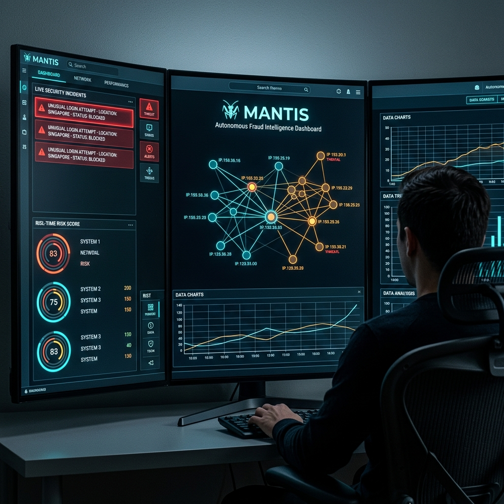
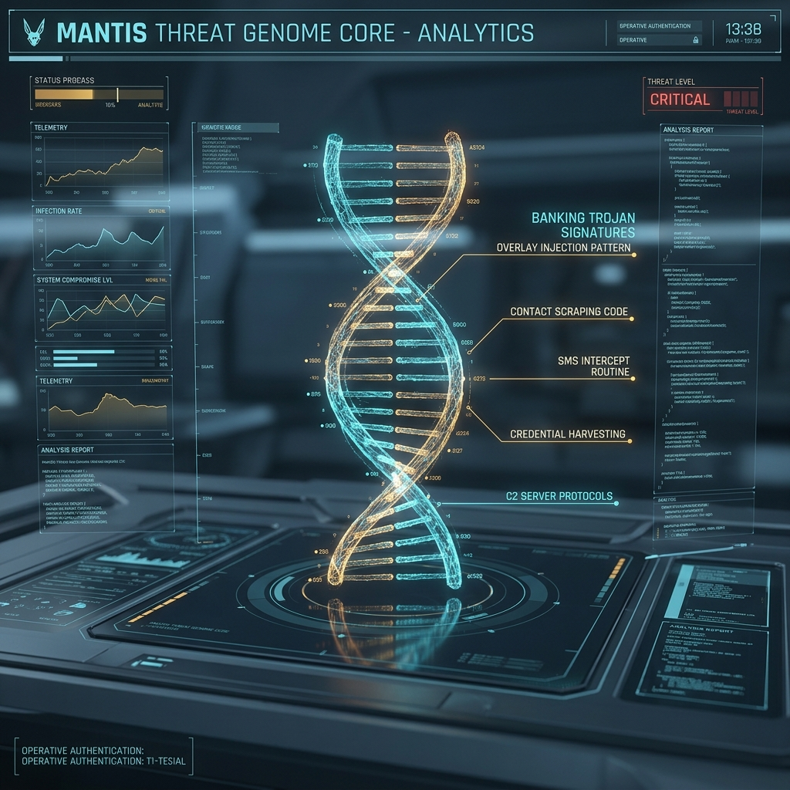
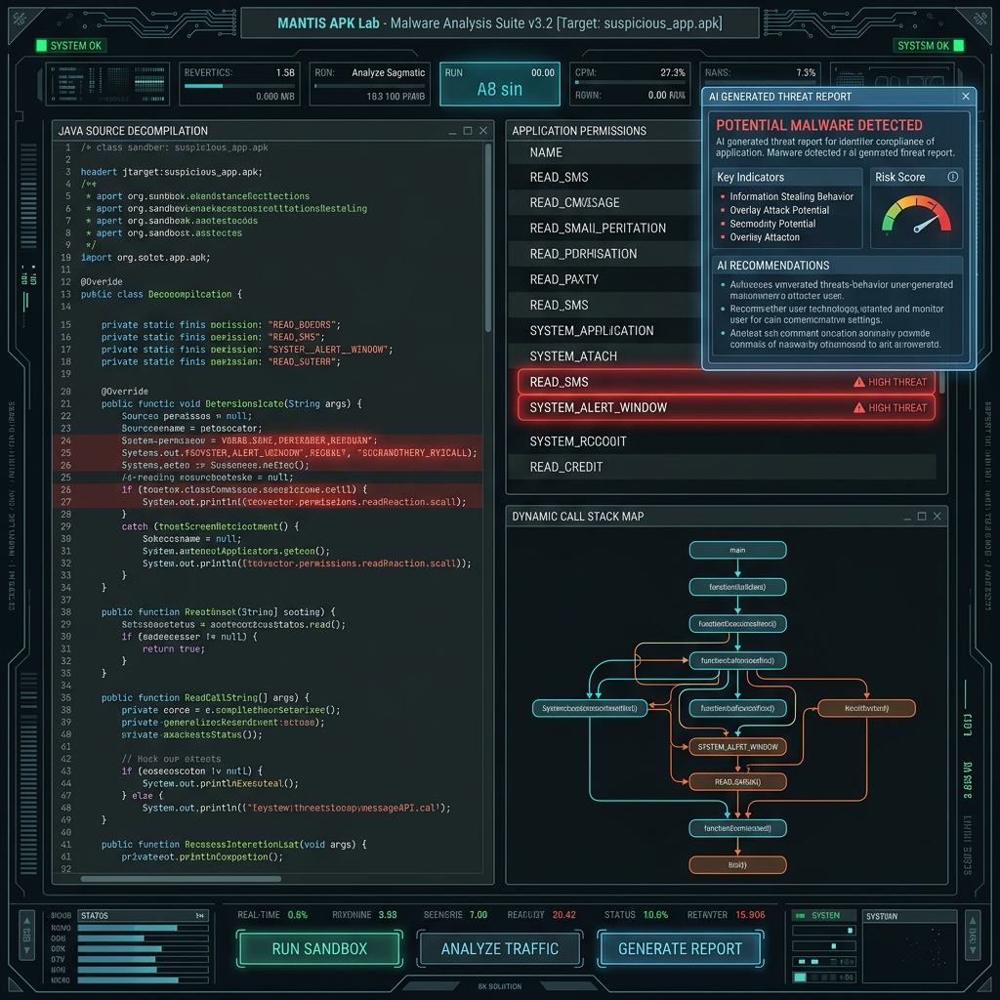

# <div align="center"><br>🤖 MANTIS 🤖</div>

<div align="center">
  <h3>Autonomous Fraud Intelligence Ecosystem — Unified Threat Correlation Operating System</h3>
  <p>
    <strong>Predict, Correlate, Deceive, and Neutralize Advanced Financial Cyber Threats in Real-Time</strong>
  </p>
  
  [](https://vitejs.dev/)
  [](https://react.dev/)
  [](https://tailwindcss.com/)
  [](https://ai.google.dev/)
</div>

---

## 🌌 Project Overview

**MANTIS** is a cutting-edge, autonomous cyber threat intelligence and active deception platform tailored for identifying, tracking, and disrupting financial fraud syndicates. By combining Graph Neural Networks (GNNs), real-time heuristic sequence tracking, and generative deception pipelines powered by **Gemini 3.5 Flash**, MANTIS maps the digital signatures of banking Trojans and automatically deploys decoys to misdirect attackers.

## 🎯 Key Capabilities & Dashboards

MANTIS is structured around five main intelligence dashboards:

### 1. Fraud Constellation (Unified Correlation Galaxy)
* **What it does:** Visualizes relationships between compromised targets, command & control (C2) servers, active banking Trojans, and mule bank accounts.
* **Technology:** Dynamic interactive force-directed graph (D3.js) modeling real-time nodes and connections, highlighting anomaly vectors.

### 2. Threat Genome Core
<div align="center">
  
</div>

* **What it does:** Breaks down banking Trojan behaviors (such as overlay injection, SMS reader capture, contact exfiltration) using a rotating 3D DNA-like helix.
* **Technology:** Micro-animated visual sequences showing signature genome nodes mapped to Trojan capabilities.

### 3. Laundering Nexus
* **What it does:** Graph-based financial link analysis that traces money routing, identifies suspicious Paytm/UPI accounts, and maps cooperative laundering rings.
* **Technology:** Advanced node categorization pointing out high-risk clearing house nodes.

### 4. Threat Oracle
* **What it does:** Transformer-driven predictive engine that forecasts money exfiltration branches and attacker moves before withdrawals take place.
* **Technology:** Visualizes divergent potential future threat timelines, calculating branch probability scores.

### 5. APK Sandbox & Assembly Lab
<div align="center">
  
</div>

* **What it does:** Provides an interactive reverse-engineering simulation. Users can upload/simulate malicious Android APK files, analyze requested permissions, extract API signatures, and generate Gemini-powered explainable AI reports highlighting threat behaviors.

### 6. Defense Deception Engine
* **What it does:** Monitors incoming Trojan packets and generates context-aware, synthetic credentials/OTP responses to feed back to C2 servers, spoiling exfiltrated datasets.

---

## 🛠 Tech Stack & Architecture

* **Frontend Engine:**
  * **React 19** & **TypeScript** — Component architecture and state safety.
  * **Vite 6** — Ultra-fast bundler and hot module replacement.
  * **Motion (framer-motion)** — High-performance, hardware-accelerated animations.
  * **Tailwind CSS v4** — High-speed utility-first styling with modern design variables.
  * **Lucide React** — Minimalist vector iconography.

* **Backend Engine:**
  * **Node.js** & **Express** — Serves API routes and integrates Vite middleware in development.
  * **tsx** — Direct execution of TypeScript server code.
  * **Google GenAI SDK (`@google/genai`)** — Coordinates prompts and structures output using Gemini models for threat intelligence reporting and deception synthesis.

---

## 🚀 Getting Started

### Prerequisites
- [Node.js](https://nodejs.org/) (v18.x or later recommended)
- A **Gemini API Key** (Get one from [Google AI Studio](https://aistudio.google.com/))

### 1. Clone & Install
```bash
git clone https://github.com/gurarpitzz/MANTIS.git
cd MANTIS
npm install
```

### 2. Configure Environment Variables
Create a `.env` file in the root directory:
```env
GEMINI_API_KEY=your_gemini_api_key_here
NODE_ENV=development
```

### 3. Run Development Server
```bash
npm run dev
```
Open **[http://localhost:3000](http://localhost:3000)** in your browser to view the application.

### 4. Production Build & Start
To build and run the optimized production bundle:
```bash
npm run build
npm start
```

---

## 🛡️ License

This project is licensed under the MIT License - see the [LICENSE](LICENSE) file for details.
